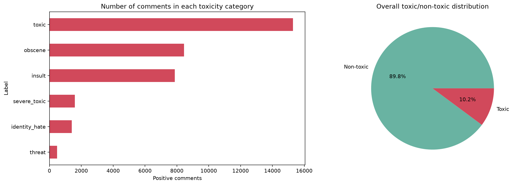
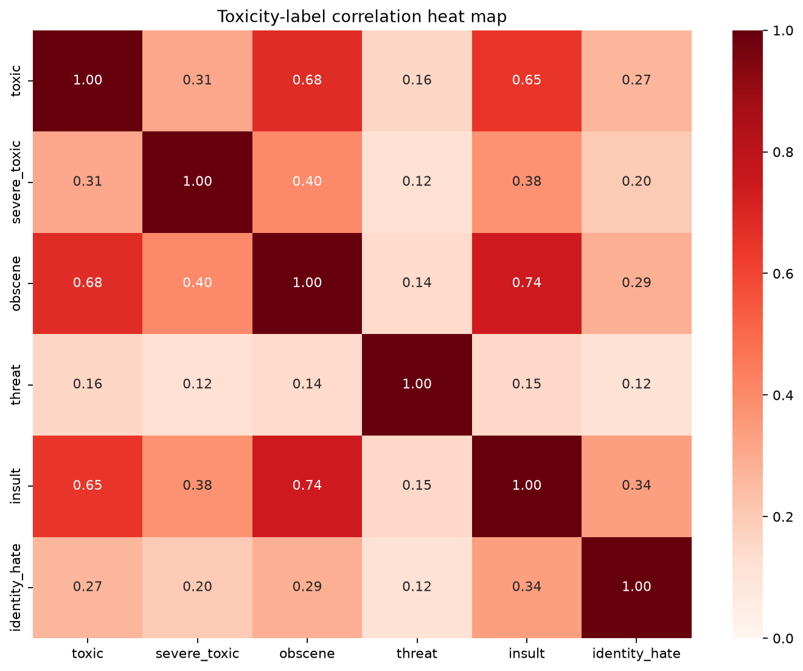
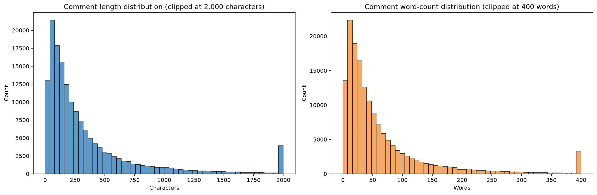
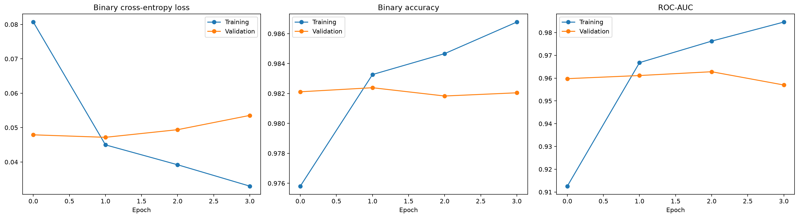
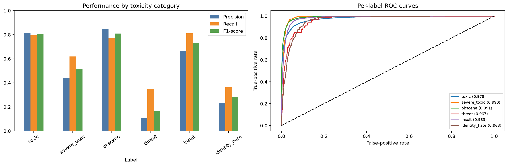
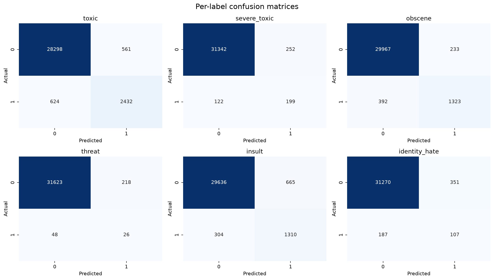

<div align="center">

# Toxic Comment Classifier

### A deep learning NLP project for detecting toxic, abusive, and harmful online comments 💬


</div>

---

## Table of Contents

- [Overview](#overview)
- [Business Problem](#business-problem)
- [Key Features](#key-features)
- [Tech Stack](#tech-stack)
- [Dataset Summary](#dataset-summary)
- [Exploratory Data Analysis and Preprocessing](#exploratory-data-analysis-and-preprocessing)
- [Modeling Workflow](#modeling-workflow)
- [Model Architecture](#model-architecture)
- [Model Performance](#model-performance)
- [Dashboard](#dashboard)
- [Screenshots and Visual Results](#screenshots-and-visual-results)
- [Project Structure](#project-structure)
- [Future Improvements](#future-improvements)

---

## Overview

**Toxic Comment Classifier** is a Deep Learning and Natural Language Processing project that detects toxic behavior in comments using a **Bidirectional LSTM** neural network.

The project classifies each comment into one or more toxicity categories:

- `toxic`
- `severe_toxic`
- `obscene`
- `threat`
- `insult`
- `identity_hate`

The complete workflow is implemented in a single notebook:

```text
Notebook/Toxic_comment_classifier.ipynb
```

The notebook includes:

- Data loading and quality checks
- Text preprocessing
- Exploratory data analysis
- Text vectorization
- Bidirectional LSTM training
- Per-label threshold calibration
- Evaluation reports and visualizations
- Custom comment prediction
- Interactive notebook and Streamlit dashboards

---

## Business Problem

Online platforms receive thousands or millions of comments every day. Manually reviewing all comments is slow, costly, and difficult to scale. Toxic language can reduce user trust, damage community quality, and create unsafe digital spaces.

This project frames toxic comment detection as a **multilabel text classification problem**:

```text
Input  : User comment text
Output : Toxicity probabilities for six labels
```

| Area | Impact |
| --- | --- |
| Social media moderation | Helps identify abusive or harmful comments |
| Online communities | Supports healthier discussion spaces |
| Content safety | Flags high-risk text for review |
| User protection | Reduces exposure to harassment and hate speech |
| Automation | Assists moderation teams with scalable filtering |

---

## Key Features

| Feature | Description |
| --- | --- |
| 💬 Toxic Comment Detection | Classifies text into six toxicity categories |
| 🧹 Text Preprocessing | Cleans URLs, special characters, casing, and extra spaces |
| 📊 EDA Visuals | Includes label distribution, correlation heatmap, and comment length analysis |
| 🧠 BiLSTM Modeling | Uses a Bidirectional LSTM for sequence-based text learning |
| 🎯 Multilabel Prediction | Allows one comment to belong to multiple toxicity classes |
| ⚖️ Threshold Calibration | Uses per-label thresholds to improve rare class detection |
| 📈 Model Evaluation | Reports F1-score, ROC-AUC, confusion matrices, and per-label metrics |
| 📊 Dashboard | Provides notebook and generated Streamlit dashboards for custom predictions |
| ⭐ Portfolio Ready | Clean README, visual outputs, project structure, and reproducible workflow |

---

## Tech Stack

<div align="center">


</div>

---

## Dataset Summary

The project uses the **Jigsaw Toxic Comment Classification** dataset.

| Property | Value |
| --- | --- |
| Dataset | Jigsaw Toxic Comment Classification |
| Main file | `Jigsaw_Dataset/train.csv` |
| Total training records | 159,571 |
| Problem type | Multilabel text classification |
| Input column | `comment_text` |
| Output labels | 6 toxicity categories |

### Target Labels

| Label | Positive Comments | Percentage |
| --- | ---: | ---: |
| `toxic` | 15,294 | 9.58% |
| `obscene` | 8,449 | 5.29% |
| `insult` | 7,877 | 4.94% |
| `severe_toxic` | 1,595 | 1.00% |
| `identity_hate` | 1,405 | 0.88% |
| `threat` | 478 | 0.30% |

The dataset is highly imbalanced. Common classes such as `toxic`, `obscene`, and `insult` have far more examples than rare classes such as `threat` and `identity_hate`.

---

## Exploratory Data Analysis and Preprocessing

The EDA section studies the dataset from both text and label-distribution perspectives.

### Analysis Performed

- Checked dataset shape and missing values
- Analyzed positive label counts
- Visualized class imbalance
- Compared toxic and non-toxic comment frequency
- Studied comment length distribution
- Created label correlation heatmap
- Inspected multilabel relationships between toxicity classes

### Text Preprocessing

| Step | Description |
| --- | --- |
| Lowercasing | Converts all text to lowercase |
| URL removal | Removes links and web references |
| Character cleaning | Keeps useful text symbols and removes noisy characters |
| Whitespace cleanup | Removes repeated spaces |
| Vectorization preparation | Prepares clean text for Keras `TextVectorization` |

### Key EDA Insights

| Area | Insight |
| --- | --- |
| Class imbalance | Rare labels such as `threat` have very few positive samples |
| Multilabel nature | One comment can belong to more than one toxicity category |
| Common labels | `toxic`, `obscene`, and `insult` appear most frequently |
| Rare labels | `threat` and `identity_hate` are harder to detect reliably |
| Thresholding | A single `0.50` threshold is not ideal for every label |

---

## Modeling Workflow

```mermaid
flowchart LR
    A[Raw Comment Dataset] --> B[Data Quality Checks]
    B --> C[Text Preprocessing]
    C --> D[EDA and Visualization]
    D --> E[Train Validation Split]
    E --> F[TextVectorization]
    F --> G[Embedding Layer]
    G --> H[Bidirectional LSTM]
    H --> I[Sigmoid Multilabel Output]
    I --> J[Threshold Calibration]
    J --> K[Evaluation and Dashboard]
```



### Notebook Pipeline

The complete modeling workflow is implemented in:

```text
Notebook/Toxic_comment_classifier.ipynb
```

#### Steps

1. Load the Jigsaw toxic comment dataset.
2. Perform data quality checks.
3. Clean and normalize comment text.
4. Explore label distribution and text length.
5. Split data into training and validation sets.
6. Adapt a Keras `TextVectorization` layer.
7. Build a Bidirectional LSTM neural network.
8. Train the model with binary cross-entropy loss.
9. Evaluate model probabilities on validation data.
10. Calibrate per-label thresholds using validation F1-score.
11. Generate evaluation plots and CSV reports.
12. Save the trained model.
13. Test custom comments.
14. Display notebook and Streamlit dashboards.

---

## Model Architecture

The classifier uses a text sequence deep learning architecture.

```text
Input Comment
    |
    v
Text Cleaning
    |
    v
TextVectorization
    |
    v
Embedding Layer
    |
    v
Bidirectional LSTM
    |
    v
Dense Layers
    |
    v
Sigmoid Output Layer
    |
    v
Six Toxicity Probabilities
```

### Architecture Configuration

| Layer / Component | Configuration |
| --- | --- |
| Text vectorizer | Keras `TextVectorization` |
| Maximum tokens | 50,000 |
| Sequence length | 200 |
| Embedding dimension | 128 |
| Recurrent layer | Bidirectional LSTM |
| LSTM units | 64 |
| Output units | 6 |
| Output activation | Sigmoid |
| Loss function | Binary cross-entropy |
| Optimizer | Adam |

### Threshold Calibration

Instead of forcing every label to use the same `0.50` cutoff, the project computes validation-based thresholds for each label.

| Label | Calibrated Threshold |
| --- | ---: |
| `toxic` | 0.3898 |
| `severe_toxic` | 0.2564 |
| `obscene` | 0.4488 |
| `threat` | 0.0576 |
| `insult` | 0.2745 |
| `identity_hate` | 0.1642 |

This is especially useful for rare labels such as `threat` and `identity_hate`.

---

## Model Performance

### Training Summary

| Split | Records |
| --- | ---: |
| Total rows used | 159,571 |
| Training rows | 127,656 |
| Validation rows | 31,915 |

### Performance Summary

| Metric | Score |
| --- | ---: |
| Micro F1 | 0.7317 |
| Macro F1 | 0.5511 |
| Micro ROC-AUC | 0.9871 |
| Macro ROC-AUC | 0.9786 |

### Per-Label Classification Report

| Label | Precision | Recall | F1-score | Support |
| --- | ---: | ---: | ---: | ---: |
| `toxic` | 0.8126 | 0.7958 | 0.8041 | 3,056 |
| `severe_toxic` | 0.4412 | 0.6199 | 0.5155 | 321 |
| `obscene` | 0.8503 | 0.7714 | 0.8089 | 1,715 |
| `threat` | 0.1066 | 0.3514 | 0.1635 | 74 |
| `insult` | 0.6633 | 0.8116 | 0.7300 | 1,614 |
| `identity_hate` | 0.2336 | 0.3639 | 0.2846 | 294 |

### Result Interpretation

- The model performs strongly on frequent classes such as `toxic`, `obscene`, and `insult`.
- Rare labels have lower precision because they have fewer positive training examples.
- `threat` is the most difficult label because it appears in only about `0.30%` of training comments.
- Per-label threshold calibration improves recall for rare toxicity classes.
- ROC-AUC scores show the model separates toxic and non-toxic patterns well at the probability level.

---

## Dashboard

The project includes two dashboard options:

| Dashboard | Description |
| --- | --- |
| Notebook dashboard | Uses `ipywidgets` inside the Jupyter notebook |
| Streamlit dashboard | Generated automatically inside `.generated/` from the notebook |

The dashboard allows the user to enter a custom comment and view:

- Probability score for each toxicity label
- Calibrated threshold for each label
- Detected categories
- Horizontal probability chart
- Overall toxicity score

---

## Screenshots and Visual Results

### EDA: Label Distribution



### EDA: Label Correlation Heatmap



### EDA: Comment Length Distribution



### LSTM: Training Curves



### Model Evaluation



### Confusion Matrices



---

## Project Structure

```text
Toxic Comment Classifier/
|-- Jigsaw_Dataset/
|   |-- train.csv
|   |-- test.csv
|   `-- test_labels.csv
|-- Notebook/
|   `-- Toxic_comment_classifier.ipynb
|-- Results/
|   `-- plots/
|       |-- label_distribution.png
|       |-- label_correlation_heatmap.png
|       |-- comment_length_distribution.png
|       |-- lstm_training_history.png
|       |-- model_evaluation.png
|       `-- confusion_matrices.png
|-- models/
|   |-- toxic_bilstm.keras
|   `-- label_thresholds.json
|-- reports/
|   |-- lstm_metrics.json
|   |-- per_label_results.csv
|   `-- label_thresholds.csv
|-- requirements.txt
|-- .gitignore
`-- README.md
```

---


## Future Improvements

- Fine-tune transformer models such as BERT, RoBERTa, or DistilBERT.
- Improve rare-label detection for `threat` and `identity_hate`.
- Add class weighting or focal loss for imbalance handling.
- Deploy the model as a web application.

---

<div align="center">

**Built with Python, TensorFlow, NLP, and Deep Learning**


</div>
